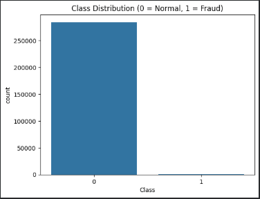
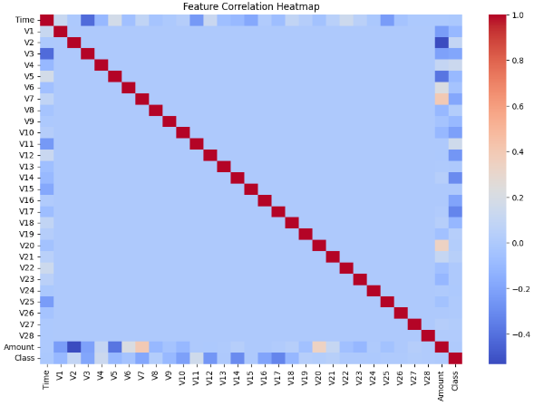
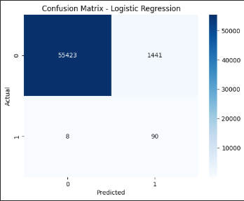
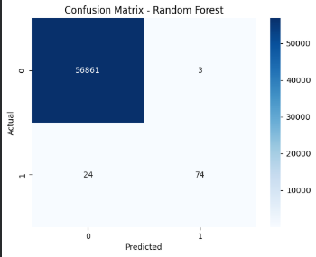
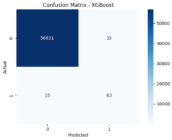
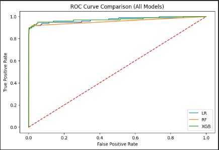
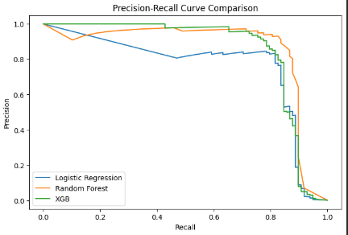
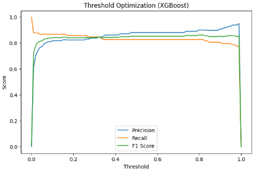
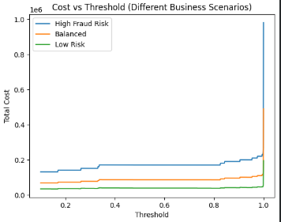
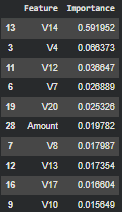

# Credit Card Fraud Detection

A fraud detection project built on real transaction data. The main challenge here isn't the model — it's the data: only 492 out of 284,807 transactions are actually fraudulent (~0.17%). That kind of imbalance breaks most standard approaches, so a lot of the work went into handling it properly.

---

## The Problem

With such few fraud cases, a model that just predicts "not fraud" every single time would be ~99.8% accurate. That's obviously useless. So accuracy is out as a metric. The real question is: can the model catch actual fraud without drowning analysts in false alerts?

That's the tension this project tries to navigate.

---

## What's in the Dataset

- ~284,000 transactions, 492 fraudulent
- Features V1–V28 are PCA-transformed (the original features are confidential)
- `Amount` and `Time` are the only raw columns — `Time` was dropped, `Amount` was scaled

---

## Approach

### Models

Three models were tested in order of complexity:

1. **Logistic Regression** — baseline. Catches almost all fraud (recall ~0.92) but flags way too many legitimate transactions as suspicious (precision ~0.06).
2. **Random Forest** — much better precision (~0.96) but misses more fraud (recall ~0.76). More conservative.
3. **XGBoost** — best overall. Precision ~0.88, recall ~0.83, F1 ~0.85. Handles the imbalance better using `scale_pos_weight`.

### Handling Imbalance

- Logistic Regression and Random Forest used `class_weight='balanced'`
- XGBoost used `scale_pos_weight` (ratio of negatives to positives)
- Avoided accuracy entirely — used Precision, Recall, F1, and PR-AUC instead

### Threshold Tuning

Default threshold (0.5) isn't always the right call, especially on imbalanced data. Thresholds from 0.1 to 0.6 were tested. The final threshold (~0.17) was picked two ways:

- **F1-based**: highest statistical balance between precision and recall
- **Cost-based**: minimized total financial loss across three business scenarios (high risk, balanced, low risk)

Both approaches landed on nearly the same threshold, which is a good sign.

### Hyperparameter Tuning

RandomizedSearchCV over 15 iterations with 3-fold CV. Best params: 300 estimators, max depth 10, learning rate 0.1, subsample 0.8.

Before tuning: F1 ~0.78, PR-AUC ~0.85  
After tuning: F1 ~0.85, PR-AUC ~0.87

### Cross-Validation

Stratified K-Fold (5 splits) on the tuned XGBoost:
- Recall: 0.827 ± 0.023
- PR-AUC: 0.861 ± 0.024

Low variance across folds — the model isn't just getting lucky on one split.

---

## Results (Tuned XGBoost)

| Metric | Value |
|---|---|
| Precision | ~0.88 |
| Recall | ~0.83 |
| F1 Score | ~0.85 |
| PR-AUC | ~0.87 |
| ROC-AUC | ~0.97 |

> ROC-AUC looks great across all three models, but it's misleading here — when negatives dominate this heavily, even a weak model gets a high ROC-AUC. PR-AUC is the honest metric for fraud detection.

---

## Visualizations

### Class Distribution


### Feature Correlation Heatmap


### Confusion Matrices




### Model Comparison



### Threshold Analysis



### Feature Importance


## Tech Stack

Python, Pandas, NumPy, Scikit-learn, XGBoost, Matplotlib, Seaborn

---

## Project Structure

```
fraud_detection
README.md
plots/
```

---

## What Could Be Better/Future additions

- SMOTE or undersampling instead of just reweighting
- SHAP values for explainability (V14 dominates feature importance but it's a PCA component — hard to interpret without more context)
- Real-time scoring pipeline
- Non-anonymized features would make the whole thing more interpretable
